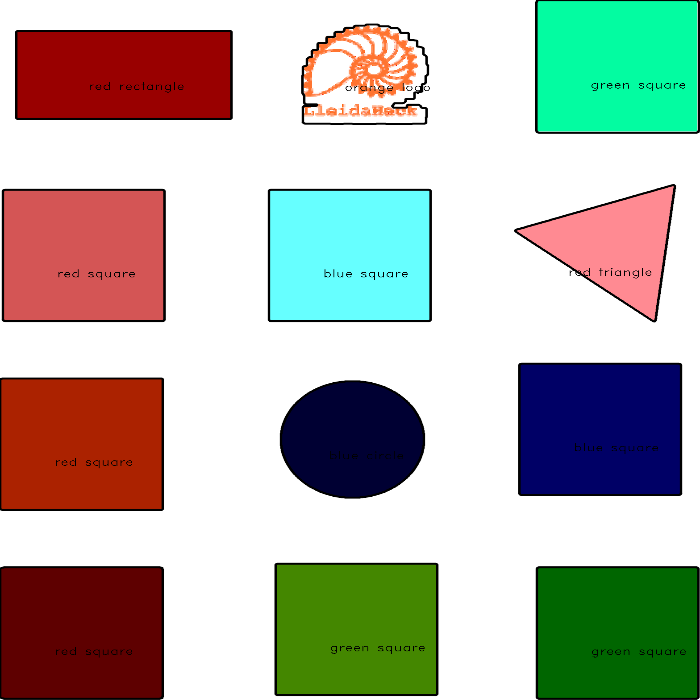

# image-classification-hack-eps
Third daily hack along the HackEPS 2022 edition: on image classification

## Local environment
To locally run the model, the following conda environment can be created:
```console
conda create --name image-hack python=3.9 -y
conda activate image-hack
pip install opencv-python
conda install -c menpo opencv -y 
# conda install -c conda-forge argparse -y  # already installed probably
```

## How to execute the code
```console
$ (hack-eps) python main.py -i path/to/image.png
```

Where ``path/to/image.png`` is the (local or absolute) path to the image.

There is also the possibility to preview 2 additional things as output 
of the computation:
- The image labeled with the found colors & shapes. For that the ``-v`` 
flag (equivalently, with ``--visualize``) has to be added:
```console
$ (hack-eps) python main.py -i path/to/image.png -v True
```
- Each of the 3 masks for the colors, as well as the one corresponding 
to the logo. In this case, the ``-m`` flag (equivalently, with ``--mask``) 
has to be added:
```console
$ (hack-eps) python main.py -i path/to/image.png -m True
```

Of course, are optional and compatible, and by default are set to False.
Below, you can check an example for each of the former 2 visualizations
(**to close the emergent tabs press** ``Esc``):

### Color & shape visualization



### Color masks visualization

